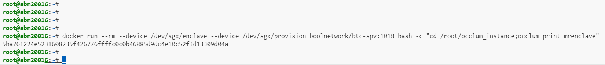
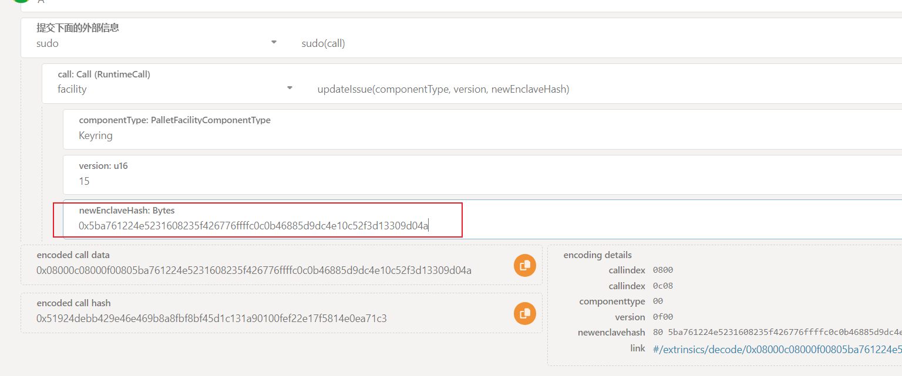
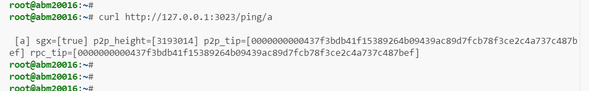

# 部署monitor-sgx和spv-sgx以及配套的watcher的步骤

单独btc的版本

如果部署的位置和devnet的网是联通的话，其中的许多url/ip可以直接用，只需要配置对应的正确的`device-owner`和`watcher-device-id`


# 链上注册enclave_hash

获得 enclave_hash:

`docker run --rm --device /dev/sgx/enclave --device /dev/sgx/provision boolnetwork/btc-spv:1018 bash -c "cd /root/occlum_instance;occlum print mrenclave"`



将返回值 `5ba761224e5231608235f426776ffffc0c0b46885d9dc4e10c52f3d13309d04a`
更新到版本上




sgx版本的monitor也按照相同方式注册enclavehash 上链

# SPV

## 1. pull images 
1.1 spv images：
`docker pull boolnetwork/btc-spv :1018`

## 2. 配置spv
例子:

```
docker run --name=btc-spv-devnet -d --net=host --restart=unless-stopped  --device /dev/sgx/enclave --device /dev/sgx/provision -v /mnt/data-devnet/db:/root/occlum_instance/db -v /mnt/data-devnet/naka:/root/occlum_instance/btc boolnetwork/btc-spv:1018 bash -c "cd /root/occlum_instance;RUST_LOG=client=debug,spv=debug occlum run /bin/btc-spv --daemon-rpc-addr="192.168.36.15:18332" --cookie="btc:btc" --http-addr="127.0.0.1:3023" --subclient-url="ws://192.168.200.16:9944" --device-owner="0x8fb4Be3a8ABa83a17ce4206e6C28a581D1EfE5A0" --watcher-device-id="0x231dd5d62c66972f30a72fd60ef2441a6157026efb605d1301d8d63c96fdbeb2" --execution-rpc=http://192.168.41.21:8545 --consense-rpc=http://192.168.41.21:3500 --sgx-enable --store=/host/db --disable-helios --eth-network=sepolia"
```
说明:

其中 `--daemon-rpc-addr="192.168.36.15:18332" --cookie="btc:btc" `分别是btc全节点bitcoind的rpc，beta-testnet用的是testnet3
cookie是bitcoind的rpc认证

`--subclient-url="ws://192.168.200.16:9944" ` 是bool链的beta-testnet的url

`--device-owner= --watcher-device-id=` 选择一台 watcher(keyring)，然后填入其device_owner和device_id

这两个在本btc版本中用不到，他们是eth的rpc地址
`--execution-rpc=http://192.168.41.21:8545 --consense-rpc=http://192.168.41.21:4000`  这个填prysm和geth的rpc地址
--execution-rpc是geth
--consense-rpc是prysm

## 3. 启动后
放着等待同步完成
大约20分钟后
可以通过`curl http://127.0.0.1:3023/ping/a`

查看同步进度:等待p2p_height=320多万左右就是同步完了
（rpc-btc和rpc-eth高度不用等,已经同步完了）
之后大约25分钟p2p-btc能同步完毕



ping后的返回值大概如下

` [a] sgx=[true] p2p_height=[3192173] p2p_tip=[0000000000532c233dc0481ff56a6e6294824cf81123e37f98c3c87ad2810ae0] rpc_tip=[0000000000532c233dc0481ff56a6e6294824cf81123e37f98c3c87ad2810ae0] `

# monitor
## 1. pull images

`git pull boolnetwork/monitor-sgx:1018`

## 2 配置
照旧，主要是在原本的congif中新增一组`[reg_config]`

例子:

```docker run --name=monitor-sgx-devnet -d --net=host --restart=unless-stopped  --device /dev/sgx/enclave --device /dev/sgx/provision -v /mnt/data-monitor/:/root/occlum_instance/monitor boolnetwork/monitor-sgx:1018 bash -c "cd /root/occlum_instance;cp ./monitor/config.toml ./config.toml;RUST_LOG=debug,sqlx=warn,hyper=info,reqwest=info,subxt=info,jsonrpsee_ws_client=warn,substrate_subxt=warn,near_jsonrpc_client=warn,subxt::nonce=debug occlum run /bin/bnk-monitor /host/config.toml"```

具体操作:

需要在原版的config中加入一组config:

```
[reg_config]
subclient_url = "ws://192.168.200.17:9944"
subclient_warn_time = 30
config_version = 16
device_owner = "0x8fb4Be3a8ABa83a17ce4206e6C28a581D1EfE5A0"
watcher_devicdid = "0x231dd5d62c66972f30a72fd60ef2441a6157026efb605d1301d8d63c96fdbeb2"
sgx = true
spv_url = "http://127.0.0.1:3023"
only_btc = true
```
`subclient_url `填bool bete-testnet的url

`device_owner`
`watcher_devicdid`
填的上面spv的一样的

`spv_url`填上面spv的url,spv中通过--http-addr="127.0.0.1:3023"设置

## 启动


# watcher
image照旧

配置中将一个选项改成 ture

`monitor_sgx = ture`

 其他照旧